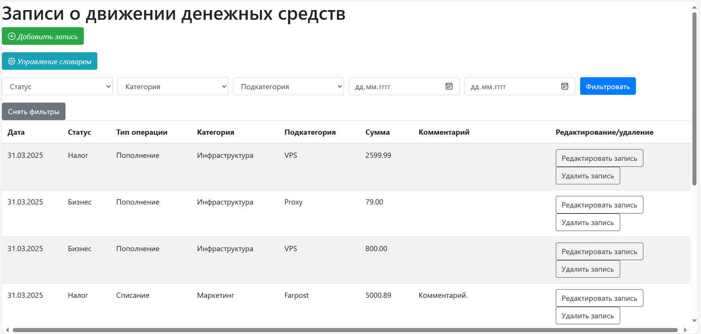
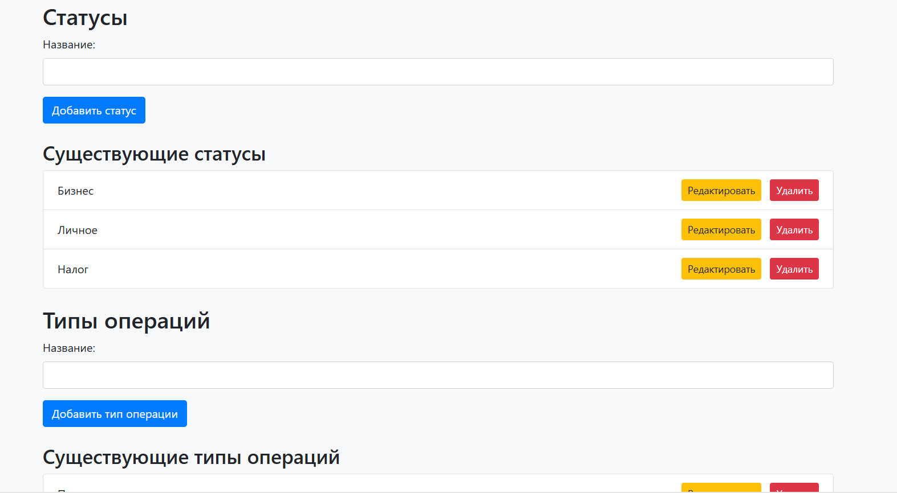
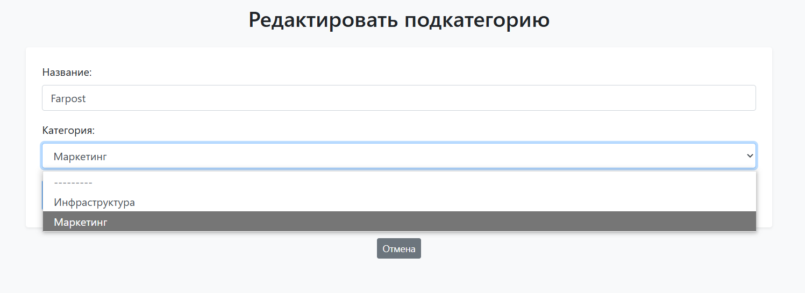

# Инструкция по запуску проекта
1. Клонирование репозитория в директорию git clone https://github.com/Viktoria-Maltseva/dds.git
2. Создание виртуального окружения: python -m venv venv
3. Активация ВО: venv\Scripts\activate (для Windows), source venv/bin/activate (для Linux)
4. Установка необходимых зависимостей из requirements.txt: pip install -r requirements.txt
5. Подключение базы данных:
- Создание файла .env в корневой директории
- В файле .env прописать переменные окружения:
    - DB_NAME='название БД'
    - DB_USER='имя пользователя'
    - DB_PASSWORD='пароль'
    - DB_HOST='хост'
    - DB_PORT='порт'
- Сделать миграции: python manage.py migrate
- Шаги для создания бд локально (через sql shell (postgres)):
    - Создание бд: CREATE DATABASE bd_name;
    - Создание роли пользователя: CREATE ROLE name with password 'password';
    - Выдача возможности входа: ALTER ROLE "name" WITH LOGIN;
    - Выдача прав на использование бд (здесь выдача всех прав): GRANT ALL PRIVILEGES ON DATABASE "bd_name" to name;
    - Подключение к бд \c bd_name
    - Выдача прав на публичную схему: CRANT ALL ON schema public TO name;
- Либо использование хостинга с бд. 
6. Запуск проекта: python manage.py runserver. Доступ будет по http://127.0.0.1:8000/

# Скриншоты интерфейса.

## Главная страница

## Форма редактирования записи

## Страница управления словарем

## Редактирование позиции словаря
