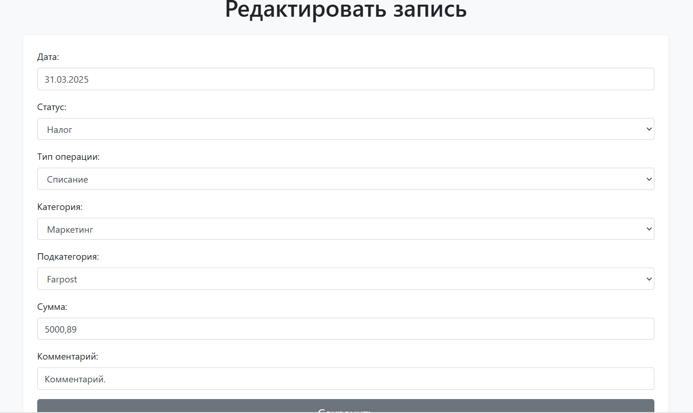

<title>Инструкция по запуску проекта</title>
1. Клонирование репозитория в директорию git clone https://github.com/Viktoria-Maltseva/dds.git
2. Создание виртуального окружения: python -m venv venv
3. Активация ВО: venv\Scripts\activate (для Windows), source venv/bin/activate (для Linux)
4. Установка необходимых зависимостей из requirements.txt: pip install -r requirements.txt
5. Подключение базы данных:
- Создание файла .env в корневой директории
- В файле .env прописать переменные окружения:
DB_NAME='название БД'
DB_USER='имя пользователя'
DB_PASSWORD='пароль'
DB_HOST='хост'
DB_PORT='порт'
- Сделать миграции: python manage.py migrate
6. Запуск проекта: python manage.py runserver. Доступ будет по http://127.0.0.1:8000/

<title>Скриншоты интерфейса.</title>

